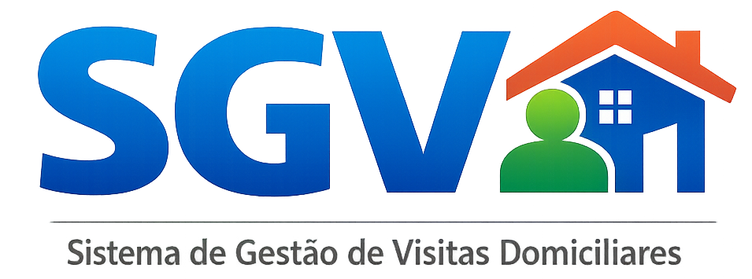

<p align="center"></p>

# SGV-Sistema de Gestão de Visitas

## Sistema de Gestão de Visitas Domiciliares

O **SGV-Sistema de Gestão de Visitas** é um sistema web desenvolvido para apoiar a organização, o controle e o acompanhamento das **visitas domiciliares exigidas pelo CadÚnico(MDS)**, especialmente após o decreto federal de 2025 que tornou obrigatória a visita para cadastros unipessoais.

O sistema foi idealizado a partir de uma necessidade real vivenciada em ambiente público, onde o controle era feito por planilhas compartilhadas em rede, sujeitas a conflitos de acesso, perda de dados e dificuldades logísticas.


## 📌 Contexto

Atualmente, unidades de atendimento como o CRAS realizam cadastros e atualizações do CadÚnico. Com a obrigatoriedade de visitas domiciliares para determinados perfis, surgiu a necessidade de um controle mais eficiente das demandas, responsáveis e status das visitas.

O SGV-Sistema de Gestão de Visitas surge como uma solução para **centralizar essas informações em um sistema web**, permitindo acesso simultâneo por múltiplos usuários e garantindo integridade dos dados.


## 🎯 Objetivo

Centralizar e organizar o registro e acompanhamento das visitas domiciliares do CadÚnico, substituindo planilhas manuais e oferecendo mais controle, segurança e rastreabilidade das informações.


## ⚙️ Funcionalidades (MVP)

* Autenticação de usuários
* Cadastro de pessoas/famílias
* Identificação de cadastros unipessoais
* Registro e agendamento de visitas domiciliares
* Atribuição de responsáveis
* Controle de status das visitas
* Listagens com filtros por status, responsável e período


## 🔄 Fluxo de uso

1. Atendimento inicial registra a pessoa no sistema
2. Sistema identifica necessidade de visita domiciliar
3. Entrevistadores organizam e realizam as visitas
4. Após a visita, o status é atualizado no sistema
5. Registro permanece armazenado para consulta futura


## 🧱 Tecnologias utilizadas

* **Backend:** PHP com Laravel
* **Frontend:** Blade + Tailwind CSS
* **Banco de dados:** MySQL
* **Autenticação:** Laravel Fortify


## 🏛️ Observação institucional

O SGV-Sistema de Gestão de Visitas **não é um sistema oficial do Governo Federal**.

Trata-se de um projeto educacional e de portfólio, desenvolvido com base em experiências reais vivenciadas em unidades de atendimento do CadÚnico, com o objetivo de estudo, demonstração técnica e melhoria de processos.


## 📚 Finalidade do projeto

* Projeto de portfólio
* Aplicação prática de Laravel
* Estudo de modelagem de sistemas públicos
* Demonstração de resolução de problemas reais


## ⚙ Instalação e Rodando localmente

Clone o repositório

```bash
  git clone https://github.com/luangaldinodev/sgv-sistema-de-gestao-de-visitas.git
  cd CRUD-laravel-Galdino
```

Instalar dependências do PHP

```bash
  composer install
```

Criar o arquivo .env

```bash
  cp .env.example .env
```

Gerar a chave da aplicação

```bash
  php artisan key:generate
```

Configurar o banco de dados

```env
  DB_CONNECTION=mysql
  DB_HOST=127.0.0.1
  DB_PORT=3306
  DB_DATABASE=nome_do_banco
  DB_USERNAME=usuario
  DB_PASSWORD=senha
```
**Certifique-se de que o banco de dados já exista.**

Rodar as migrations

```bash
  php artisan migrate --seed
```

Instalar dependências front-end

```bash
  npm install
  npm run dev
```

Iniciar o servidor

```bash
  php artisan serve
```

Acesse:

```bash
  http://127.0.0.1:8000
```

## Suporte e Feedback

Para suporte, mande um email para luangaldinodev@gmail.com ou entre em meu instagram [@ogaldino.dev](https://www.instagram.com/ogaldino.dev/).

---
Desenvolvido como projeto de estudo e portfólio.

---

<p align="center"></p>